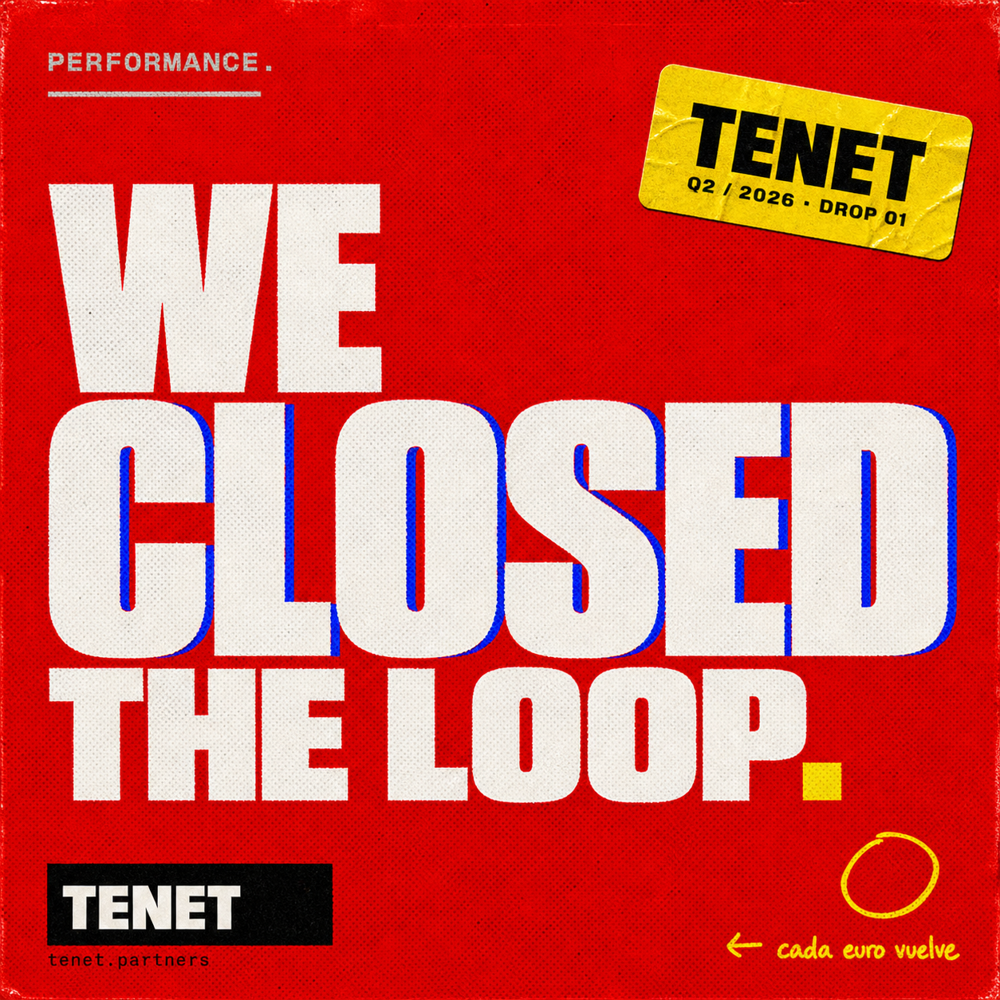

# TENET — Prompts para Nano Banana / GPT Image

> **Cómo usar:** copiar/pegar tal cual en GPT Image 1 (ChatGPT) o Nano Banana (Google). Cada prompt está optimizado para generar un asset directamente usable en el sitio. Después subes a `/assets/img/` con el filename indicado y reemplazas el placeholder Unsplash que tenemos hoy.

---

## A — HEROES Y BANNERS

### 01 — Hero alternativo (LinkedIn / OG image)
**Filename target:** `assets/img/hero-og-1200x630.png`
**Aspect:** 1200 × 630
```
A bold editorial poster, screen-printed feel, photographed flat under fluorescent light. Massive condensed sans-serif type filling the frame: top half "PERFORMANCE." in white knocked out of a deep red field with subtle CMYK misregistration; bottom half "NO MAGIA." in cream on black. Heavy halftone grain, riso-print imperfections, 1mm chromatic aberration on the type edges. Yellow circular tape sticker rotated 6 degrees in upper-right corner reading "Q2 / 2026 · DROP 01" in monospaced black letters. Tiny TENET wordmark bottom-left. The aesthetic of Stüssy posters meets Mad Men typography meets a 2001 Thrasher cover. No people, no devices, pure typographic intensity. 1200x630.
```

### 02 — Banner de pricing (header de pricing.html alternativo)
**Filename:** `assets/img/banner-pricing.png`
**Aspect:** 1600 × 600
```
A horizontal red banner, deep saturated red #E50914, with three giant white numerals stacked horizontally with thin yellow underlines, exactly: "€600" "€1.000" "€1.500". Below each, microscopic monospace caption: "META" "GOOGLE" "AMBOS". Heavy print grain texture, slight CMYK misregistration on the digits creating blue and red ghost shadows. A black rectangular ticket sticker rotated 4 degrees on the far right reads "CERO ASTERISCOS" in white Anton condensed type. Tiny line of monospace text bottom-center: "2 MESES POR ADELANTADO · DEVOLUCIÓN 60 DÍAS". All Spanish, no English. Inspired by old gas-station price boards mixed with Russian constructivist posters mixed with Vans skate ads from 2002. 1600x600 horizontal.
```

### 02b — Banner Estrategia Creativa (3 meses · pago único)
**Filename:** `assets/img/banner-estrategia.png`
**Aspect:** 1600 × 600
```
A horizontal black banner with film grain. Left half: in massive cream Anton condensed bold, three lines stacked tightly: "ESTRATEGIA" / "CREATIVA" / "3 MESES." with a thin yellow underline below "MESES". Right half: in deep red, a single giant numeral "€2.000" 320px tall, with small monospace caption below in cream "PAGO ÚNICO · NO RECURRENTE". Yellow ticket sticker rotated 5° in upper-right reading "CUPO LIMITADO". A small bottom-bar in cream monospace 11px reading "TAKEOVER META 3 MESES · AUDITORÍA · BUYER PERSONAS · CREATIVOS AI · REPORTE 5 AÑOS". All Spanish. Aesthetic: Pentagram precision meets Big Brother Magazine. 1600x600 horizontal.
```

### 03 — Manifesto cover (LinkedIn carousel slide 1)
**Filename:** `assets/img/manifesto-cover.png`
**Aspect:** 1080 × 1080
```
A square poster on cream paper textured background. In the upper-left corner, a small black-and-white parental advisory plate reading "★ ATTENTION ★ / NO PARA TODOS / PERFORMANCE · MADRID · 2026" in condensed Anton type. In the center, in 1962-Mad-Men-era serif italic Playfair Display Black 900 italic, a quote: "El marketing volvió a ser un trabajo serio." The quote is in deep ink black, with red ornamental quotation marks. Subtle paper-grain texture, slight off-register printing. A red bar runs across the bottom 5% of the canvas with the text "TENET · MADRID · 2026" in white monospace. Sterling Cooper meets Big Brother Magazine. 1080x1080.
```

---

## B — SUBPÁGINAS / SECTION HEADERS

### 04 — Sticker bomb master (background tile)
**Filename:** `assets/img/sticker-bomb-bg.png`
**Aspect:** 1600 × 1600 tileable
```
A black background covered in dozens of overlapping rectangular and circular stickers, scattered chaotically as if pasted on a skateboarder's locker over years. Stickers feature rotated text in red, yellow, blue, and bone-white: "EL LOOP ESTÁ CERRADO" "2026" "NO PARA TODOS" "SIN COOKIES" "PERFORMANCE NO MAGIA" "DROP 01" "MADRID + LATAM" "REFUND 60d" "CMD+U" "T E N E T". Each sticker has the distinct look of riso-printed matte vinyl with peeling edges, halftone grain, 90s skate-shop aesthetic. Inspired by Big Brother Magazine collages, Tony Hawk Pro Skater 2 menu screens, MTV bumper graphics. Heavy texture, 35° viewing angle, slight motion blur as if photographed in a moving van. 1600x1600 seamless tile.
```

### 05 — VHS interstitial card
**Filename:** `assets/img/vhs-card.png`
**Aspect:** 1920 × 1080 (16:9)
```
A pure VHS tracking-error frame: deep black background with horizontal scanline noise covering the entire image, three magenta-and-cyan glitch tear lines stacked vertically, low-rez chromatic aberration. Centered, in green VT323 monospace 8-bit terminal font: "▶ PLAY · SP · 2026". Below, smaller: "LOOP // CERRADO // CONTINUE? Y/N". Top-right corner, tiny red REC dot with "REC 00:14:00" text. Bottom-right, "TENET QUARTERLY · ISSUE 01" in same green monospace. The whole thing feels like a paused VHS tape from a CRT television photographed in low light. Aspect 1920x1080.
```

### 06 — THPS2-menu style poster
**Filename:** `assets/img/thps-deploy.png`
**Aspect:** 1080 × 1350 (Instagram portrait)
```
A vertical poster mimicking the menu screen of Tony Hawk's Pro Skater 2 from 2000. Black background with a dark photographic skate halfpipe at low opacity behind. Top: yellow blocky 8-bit-style text reading "// LEVEL 01 — DEPLOYMENT". Below, massive condensed Anton bold type in white: "EL RUN DE 14 DÍAS." Below that, a red 8-bit timer reading "14d:00h:00m:00s". Below the timer, a vertical list of 8 mission goals styled like THPS2 task UI: each row has a yellow vertical bar on the left, monospace VT323 text in white reading goals like "SCAN_DNS_RECORDS", "DEPLOY_GTM_SERVER_SIDE", "WIRE_META_CAPI", "VALIDATE_FIRST_REPORT" — the last one is struck through in green to indicate completed. Bottom corner: "TENET · 2026 · DROP 01". Heavy CRT scanlines overlay. 1080x1350.
```

---

## C — INSTAGRAM SCROLL-STOPPERS (4-pack)

### 07 — IG Square 1: Number bomb
**Filename:** `assets/img/ig-1-numbers.png`
**Aspect:** 1080 × 1080
```
Square poster, deep red field with grain. Three massive white numerals stacked vertically: "47%" then "22%" then "14d", each 280px tall, in Anton black condensed. Beside each, in tiny monospace cream caption to the right: "Meta lost" / "GA4 lost" / "Loop closed". A yellow rectangular ticket sticker top-right rotated 5° reads "Q2/2026 · DROP 01" black on yellow. Bottom-left small TENET wordmark on black ribbon. Bottom-right small yellow circle with "← cada euro vuelve" handwritten note arrow. Heavy halftone grain, 1mm chromatic aberration on the percentages. The aesthetic of a Russian constructivist poster reimagined by a 2001 skate brand. 1080x1080.
```

### 08 — IG Square 2: The filter
**Filename:** `assets/img/ig-2-filter.png`
**Aspect:** 1080 × 1080
```
Black background, slight paper grain. Two columns separated by a 2px red vertical line. Left column header in red Anton: "✕ NO TRABAJAMOS". Below in white sans-serif body: "→ Sin acceso DNS / → Negociadores / → < €3K en ads / → Comités de tres". Right column header in green: "✓ SÍ ENCAJAMOS". Below in white: "→ 5+ clientes activos / → Autoridad real / → Refund 60d justo / → Lees view-source". Bottom: in monospace cream "TENET · No para todos · 2026". Stüssy meets Mondrian meets Apple Health-app honesty. Heavy contrast, riso grain. 1080x1080.
```

### 09 — IG Square 3: Sator square
**Filename:** `assets/img/ig-3-sator.png`
**Aspect:** 1080 × 1080
```
Cream textured paper background. Centered, the Sator Square engraved in deep red-orange, 5 rows of 5 letters in monumental Roman capitals (Trajan-like): SATOR / AREPO / TENET / OPERA / ROTAS. The middle row TENET is highlighted with an underline in deep ink. Rough riso edges on each letter. Around the square, faint compass marks at the four corners in monospace gray reading "TIME // FORWARD" "TIME // REVERSE" "LOOP // OPEN" "LOOP // CLOSED". Bottom in serif italic Playfair: "Lo que pasó, ya pasó. Pero ahora lo sabemos." Tiny "TENET · 2026" wordmark bottom-right. Pompeii archeology meets Stefan Sagmeister monograph. 1080x1080.
```

### 10 — IG Square 4: Sticker self-portrait
**Filename:** `assets/img/ig-4-sticker.png`
**Aspect:** 1080 × 1080
```
A square photograph of a black laptop lid covered in approximately 12 overlapping stickers as if collected by a marketer over a year. Each sticker readable: "EL LOOP ESTÁ CERRADO" (red), "2026" (yellow), "NO PARA TODOS" (black), "SERVER SIDE FOREVER" (blue), "DROP 01" (cream), "T E N E T" (white on black), "SIN COOKIES SIN MIEDO" (red), "PERFORMANCE NO MAGIA" (yellow). Slightly peeling edges, halftone vinyl print quality, photograph taken under fluorescent light at 35° angle. The corner of a black coffee mug visible at the edge. Inspired by skater laptops at SXSW circa 2009. 1080x1080.
```

---

## D — UTILITY ASSETS

### 11 — Email signature banner
**Filename:** `assets/img/email-sig.png`
**Aspect:** 600 × 200
```
Horizontal banner 600x200 pixels. Pure black background with subtle grain. On the far left, the TENET wordmark in white condensed Anton bold, 48px, with a thin red underline. To the right of the wordmark, a vertical red line separator. To the right of the line, a small block: line 1 in white monospace 14px "Henry López · Founder", line 2 in cream monospace 12px "hola@tenet.partners", line 3 in red monospace 11px "tenet.partners". Far right corner: a tiny yellow circle reading "2 0 2 6" in tiny black monospace circular text. Spartan, brutalist, no decoration. 600x200.
```

### 12 — Madrid wall poster (printable A2)
**Filename:** `assets/img/wall-poster.png`
**Aspect:** 1200 × 1800
```
A vertical poster mimicking a print-shop hand-pulled riso. Three horizontal bands. Top third: deep red field with halftone grain, in massive cream Anton condensed type "PARTNERSHIP" / "MADRID" / "Q2 2026" each line slightly larger than the last. A yellow ticket sticker rotated 6° in top-right reading "01/03 CONFIDENCIAL". Middle third: black field. In white Anton bold with chromatic aberration (red and blue ghost copies offset 3px) the wordmark "TENET" in 280px height. Below in small cream monospace "← EL LOOP CERRADO" with a yellow arrow handwritten. Bottom third: deep saturated blue field. In white condensed Anton: "EL LOOP / ESTÁ CERRADO." with the period in yellow. Tiny bottom-left text: "TENET.PARTNERS · NO PARA TODOS · MADRID". A small black plus sign bottom-right. Heavy print misregistration, organic riso grain everywhere. The aesthetic of Pentagram meets Fugazi tour posters meets old Madrid bullfight playbills. 1200x1800.
```

---

## E — ANIMATED / VIDEO (para reels)

### 13 — Loop closing animation (5 sec, 1080x1080)
**Tool:** Runway / Sora / Pika
**Prompt:**
```
A 5-second seamless loop animation. Black background. A red circle starts as a dotted outline in upper-left, then a glowing red dot traces the circle clockwise, leaving a solid red trail. As the dot completes the circle and connects back to its origin, the entire circle fills with red and a yellow caption appears in the center: "LOOP CLOSED." with a satisfying snap of chromatic aberration. The number "1,247" briefly flashes in the upper-right corner. Then loops. Aesthetic: 2001 menu animation from Tony Hawk Pro Skater 2 mixed with Apple Watch close-your-rings. 1080x1080, 24fps, 5-second seamless loop.
```

---

## CÓMO INTEGRAR DESPUÉS DE GENERAR

Cuando tengas las imágenes:

```bash
# 1. Mueve las generadas a assets/img/
mv ~/Downloads/hero-og-1200x630.png ~/Desktop/tenet-site/assets/img/

# 2. En cada HTML, reemplaza el placeholder Unsplash por el nuevo asset
# Por ejemplo en index.html: cambia
#   
# por
#     (cuando aplique)

# 3. Push
cd ~/Desktop/tenet-site && git add -A && git commit -m "Update assets · drop Nano Banana batch 01" && git push
```

---

## NOTAS DE CONSISTENCIA (para que cualquier prompt nuevo se mantenga on-brand)

Siempre que generes algo nuevo, incluye al menos 3 de estos términos en el prompt:

- **Tipografía:** "condensed Anton bold", "Playfair Display Black italic" (solo Mad Men moments), "VT323 monospace" (CRT moments), "JetBrains Mono"
- **Color:** red `#E50914`, blue `#1B3CFF`, yellow `#F5D000`, cream/bone `#F5F1E8`, ink black `#0A0A0A`
- **Texturas:** "halftone grain", "riso misregistration", "CMYK chromatic aberration", "matte vinyl sticker print"
- **Año:** "2026" (siempre romanos, nunca 2026)
- **Referencias seguras de citar en el prompt:** "Stüssy posters", "Big Brother Magazine collages", "Pentagram precision", "Russian constructivist", "Mad Men 1962 Sterling Cooper", "Tony Hawk Pro Skater 2 menu UI", "Pompeii Sator Square", "Saul Bass titles"

**Nunca** menciones por nombre marcas que tengan trademark protegido (Nike, Apple, MTV) — usa descripciones genéricas. **Sí** puedes referenciar movimientos/épocas/aesthetics generales y nombres de diseñadores históricos como Saul Bass, Massimo Vignelli, Stefan Sagmeister.

---

## F — END-TO-END · DATA-IS-THE-PRODUCT (drop 02)

> Estos prompts refuerzan el reposicionamiento: TENET no es complemento técnico, es el motor completo. La data es el entregable.

### 19 — "LA DATA ES EL PRODUCTO" (poster manifesto)
**Filename:** `assets/img/data-es-producto.png` · **Aspect:** 1080 × 1350
```
A vertical poster with deep saturated red field (#E50914) covering the top two-thirds, heavy print grain and CMYK misregistration. Bottom third pure black with paper-grain texture. On the red field, in massive cream Anton condensed bold caps stacked tight: "LA DATA / ES EL / PRODUCTO." with the period in yellow. Below the headline on the red field, in tiny cream monospace 14px caps: "EL PIXEL · EL CRM · LA LANDING — SOLO HERRAMIENTAS". On the black bottom third, in cream Anton 24px caps: "TENET · MADRID · 2026". A small yellow ticket sticker rotated 6° in upper-right reads "EDICIÓN 02 · DROP 02". Heavy halftone grain, riso misregistration on every letter edge. Aesthetic: Russian constructivist meets Pentagram precision meets a 1970s Vignelli MTA poster. All Spanish. 1080x1350.
```

### 20 — "TAKEOVER" (we run it all, end to end)
**Filename:** `assets/img/takeover.png` · **Aspect:** 1600 × 900
```
A cinematic 16:9 horizontal frame, photographed on expired film stock with grain. Scene: a vintage 1990s computer monitor on a desk, screen glowing red — on the screen is a stylized full-screen takeover graphic showing a single bold cream Anton condensed word "TENET" centered, with a thin red blinking cursor underneath spelling "OPERATING_". In the foreground, soft-focus, a single black-gloved hand resting on a vintage mechanical keyboard, no person visible above the wrist. Behind the monitor, slightly out of focus, a wall of Post-It notes in yellow with handwritten Caveat-style notes (illegible at distance, just texture). The room is lit with a warm desk-lamp glow plus the cold red glare of the screen. Top-left corner: tiny cream monospace text "// REC · 00:14:00 · MADRID · 2026". Bottom-right: small TENET wordmark stamped over the photograph in yellow. Aesthetic: a 1999 hacker movie still meets a Wallpaper magazine editorial meets Big Brother Magazine darkroom photo. 1600x900 cinematic widescreen.
```

### 21 — "FUGAS DEL PIXEL" (diagnostic visual, 6-grid)
**Filename:** `assets/img/fugas-pixel.png` · **Aspect:** 1080 × 1080
```
A square poster on cream paper textured background with riso misregistration. The composition is a 2x3 grid of stylized "leak" diagrams, each cell a different hand-drawn red arrow pointing down through a torn paper edge representing data loss. Each cell labeled in tiny black Anton caps top-left: "iOS 14.5 / ITP COOKIES / BLOQUEADORES / VISTA OFFLINE / MATCH RATE / DEDUP". Numbers in giant red Anton condensed under each label: "−47%" / "−22%" / "−18%" / "−40%" / "−50%" / "−15%". Across the entire poster, overlaid at 30% opacity, a giant cream Anton diagonal slash from upper-left to lower-right reading "FUGAS". Bottom-right corner, in tiny cream monospace: "TENET · LO QUE TU PIXEL NO TE DICE · 2026". Aesthetic of editorial infographic from a 1990s tech magazine meets Stefan Sagmeister monograph. 1080x1080.
```

### 22 — "EXTREMO A EXTREMO" (full-stack diagram, brutalist)
**Filename:** `assets/img/extremo-a-extremo.png` · **Aspect:** 1600 × 600
```
A horizontal banner, deep black background with subtle grain. Across the entire width, a single horizontal flow diagram of 7 connected boxes, each in a different color from the TENET palette (red, yellow, blue, cream alternating). Each box is a square with a label in cream Anton caps inside: "01 · AUDIT" → "02 · PERSONAS" → "03 · LANDING" → "04 · TRACKING" → "05 · CRM" → "06 · CREATIVOS" → "07 · IA". Between each box, a thick yellow arrow with a riso-misregistration shadow. Above the entire flow, in tiny cream monospace caps: "LO QUE HACEMOS · TODO · SIN SUBCONTRATAR". Below: "TENET · MOTOR DE ADQUISICIÓN END-TO-END · 2026". Heavy print grain on every element. Aesthetic of a Massimo Vignelli MTA subway diagram meets a Soviet 5-year-plan poster. 1600x600 horizontal banner.
```

### 23 — "FOUNDER PORTRAIT" (stylized poster of the founder)
**Filename:** `assets/img/founder-poster.png` · **Aspect:** 1080 × 1350
```
A vertical poster, deep red field (#E50914) with heavy halftone grain. The composition is a high-contrast silhouette portrait — a single male figure from the chest up, facing slightly to the right, rendered entirely in deep navy blue (#1B3CFF) with hard rim-light, no facial features identifiable, hair short and messy, wearing a plain dark t-shirt. The portrait occupies the right two-thirds of the frame. On the left third, vertical text in massive cream Anton condensed caps stacked: "TOMO / TU / EMPRESA." with a thin yellow underline below "EMPRESA". Below the portrait, in tiny cream monospace caps: "HENRY LÓPEZ · FUNDADOR TENET · MADRID 2026". A small yellow ticket sticker rotated 5° in upper-right reads "FOUNDER'S PROMISE". The whole composition has CMYK chromatic aberration on the type edges. Aesthetic of a 1968 Cuban revolutionary poster meets a 2001 skate-shop founder portrait meets Saul Bass title card. No identifiable face, no real people. 1080x1350.
```

### 24 — "MATCH RATE 73%" (dashboard moment, single big number)
**Filename:** `assets/img/match-rate-73.png` · **Aspect:** 1080 × 1080
```
A square poster, pure black background with fine film grain. Centered, a single massive numeral "73%" in cream Anton condensed bold, 540px tall, with strong CMYK chromatic aberration (red ghost left, blue ghost right, offset 4px each). Below the number, a thin yellow horizontal line. Below the line, in tiny cream monospace caps: "MATCH RATE · CAPI · TENET DEPLOYMENT". Top-left corner: tiny green VT323 monospace "▶ LIVE · CLIENT 02". Top-right corner: tiny cream monospace "2026 · DROP 01". Around the number, faint scanlines of an old CRT display at 8% opacity. Bottom of poster: a thin red horizontal bar with cream caps reading "EMQ 8.4 · DEDUPED · CONSENT MAPPED". Aesthetic of an early-2000s sports stat broadcast graphic meets a vintage Bloomberg terminal screen meets a Saul Bass title. 1080x1080.
```

---

## G — VEO VIDEO PROMPTS · 8 SECONDS · 3 PER DAY

> Veo permite hasta 3 videos al día de 8 segundos. Estos 3 prompts están optimizados para tomar pleno aprovechamiento. Single-shot o 2-shot máximo por prompt — Veo rinde mejor con visión clara, no con narrativa compleja.

### V1 — "EL CLICK QUE NADÓ" · short reel
**Duration:** 8 seconds · 1080×1080 · 24fps
```
An 8-second underwater video clip. Camera holds steady underwater in deep cyan-blue water with strong sun rays from above. In the foreground, a single euro coin (€1) suspended in the water column, slowly drifting away from camera as if pulled by an invisible current. Sun caustics dance on the coin's surface. After 4 seconds, a cream-colored fishing net silhouette enters from the bottom edge of the frame and moves upward, gently catching the coin just before it disappears into darkness. As the net catches the coin, a soft red glow pulses once around it. Final 1 second: title text fades in over the catch — cream Anton condensed caps "EL LOOP CERRADO." with a yellow period. Heavy film grain overlay throughout. Audio: muffled underwater ambience + a single satisfying "tick" at the moment of catch. Aesthetic of 1990s underwater photography by Howard Hall + Apple Watch close-your-rings satisfaction. No human figures. 1080x1080, 24fps, 8 seconds.
```

### V2 — "TAKEOVER · 14 DAYS" · timelapse opener
**Duration:** 8 seconds · 1080×1920 (vertical · IG Reel / TikTok) · 24fps
```
An 8-second vertical video. First 2 seconds: extreme close-up of a black mechanical keyboard under a warm desk-lamp glow, fingers typing fast (only fingers visible, no face). Camera slowly pulls back. Seconds 3-5: pull-back reveals a vintage 1990s CRT monitor on the desk, screen showing scrolling green VT323 monospace text "tenet deploy --client agencia.madrid... scanning... ok... wiring meta capi... ok... wiring google ec... ok..." Each line appears every 0.4s with subtle glow. Seconds 6-7: camera continues pulling back, revealing the desk in a darkened Madrid apartment — yellow Post-It notes on the wall behind, a small framed TENET poster in red. Second 8: full pullback frame freezes, big cream Anton condensed caps fade in centered "14 DÍAS." with red period. Heavy film grain throughout. Audio: ambient room tone + mechanical keyboard clack rhythm + a final analog "thunk". Aesthetic of a 2002 hacker movie opening shot meets a Wallpaper magazine editorial spread. No identifiable face. 1080x1920, 24fps, 8 seconds.
```

### V3 — "MATCH RATE LIVE" · ticker reveal
**Duration:** 8 seconds · 1080×1080 · 24fps
```
An 8-second square video. First 1 second: pure black frame, only fine film grain visible. Second 2: a thin red horizontal line draws itself across the center from left to right. Seconds 3-5: above the line, a counter starts ticking up rapidly from "00%" → "73%" in cream Anton condensed bold caps, 540px tall, with each frame the chromatic aberration getting more intense (red ghost left, blue ghost right, growing from 1px to 5px offset). Below the line, a row of monospace events scrolls right-to-left like a stock ticker: "META.CAPI · OK · GOOGLE.EC · OK · OFFLINE.CONV · OK · DEDUP · OK · CONSENT.V2 · OK". Seconds 6-7: the counter holds at "73%" with the chromatic aberration pulsing once. Second 8: a yellow ticket sticker drops in from above with a slight bounce, lands rotated 5° in the upper-right corner reading "MATCH · LIVE · 2026". Heavy CRT scanline overlay throughout. Audio: subtle digital "blip" at each tick + a satisfying analog "thunk" at the final hold. Aesthetic of a vintage Bloomberg terminal meets ESPN sports score graphic from 2003. 1080x1080, 24fps, 8 seconds.
```

---

## CADENCIA DE GENERACIÓN SUGERIDA (próximos 3 días)

**Día 1 (hoy):** prompts 19, 20, 21 (poster manifesto + takeover scene + fugas grid) en GPT Image · prompt V1 (el click que nadó) en Veo
**Día 2:** prompts 22, 23, 24 (extremo a extremo + founder portrait + match rate) en GPT Image · prompt V2 (takeover 14 días) en Veo
**Día 3:** los 4-pack IG (07, 08, 09, 10 originales) en GPT Image · prompt V3 (match rate live) en Veo

Total cohorte completa al final del día 3: **13 prompts visuales nuevos en producción + 3 videos de 8s nuevos para Reels/TikTok/LinkedIn**.

Cuando los tengas, sube todo a `~/Desktop/tenet-site/assets/img/` (estáticos) y `~/Desktop/tenet-site/assets/video/` (crear si no existe), y push. Si necesitas que reemplace placeholders existentes con los nuevos, dime cuáles.

